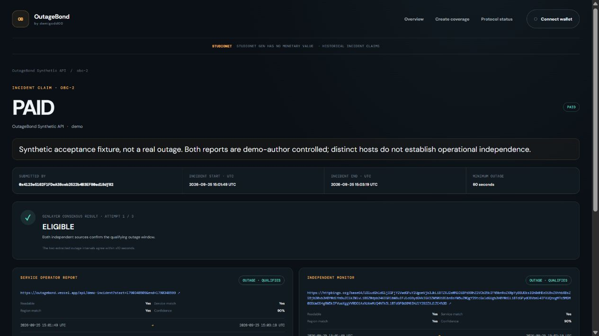

# OutageBond — reviewer guide

## Open the product

- [Live app](https://outagebond.vercel.app)
- [Finalized protocol status](https://outagebond.vercel.app/status)
- [Policy guide](https://outagebond.vercel.app/how-it-works)
- [StudioNet contract](https://explorer-studio.genlayer.com/address/0x2893BfB51B80A3ABEE168732f1B3bF86Cde08082)
- [Release source](https://github.com/Demigodd00/demigodd00-genlayer-apps/tree/codex/outagebond-review-fixes/apps/outagebond-web)
- [Contract source](../contracts/outage_bond.py), [review fixes](OUTAGEBOND_REVIEW.md), [deployment proof](../deployments/outage_bond_studionet.json)

No wallet is needed to inspect coverage, claim evidence, the consensus verdict, or protocol counters. A compatible browser wallet is needed to send writes on StudioNet chain 61999; the app requests that chain explicitly. StudioNet GEN has no monetary value.

## Why GenLayer is essential

The protocol needs validators to interpret public incident reports, not merely trust a signed status flag. Each validator fetches both pages independently and extracts service/region identity, outage status, timestamps, and confidence. Deterministic code derives the decision and rejects near-threshold disagreements, uncovered intervals, calendar-day replay, and noncanonical leader metadata. Only agreed evidence can reserve an eligible payout for the named beneficiary.

Provider collateral, immutable coverage terms, claim submission, permissionless attestation, fixed beneficiary payout, and unused-collateral recovery all execute in the native intelligent contract. No administrator chooses settlement; protocol fees are zero.

## Live acceptance evidence

The resume-safe acceptance run writes its results to `deployments/outage_bond_acceptance.json`. Its `all_checks_passed` field, finalized transaction hashes, canonical stored claim readings, native child-transfer `value_credited`, and before/after recipient balances are the evidence of success—not a frontend toast or transaction lifecycle status alone.

The paid claim is [obc-2](https://outagebond.vercel.app/claims/obc-2) under [coverage ob-4](https://outagebond.vercel.app/coverage/ob-4). Native payout transaction `0xa8d21d2d66c2839769b9a8b16dc9c8f3dc9fe283fa089e8117241e3ceaf82ab8` emitted child transfer `0xa6c94a57c4b8d6f8ea12ab2f7dca0e1d1c51d55832b6e0faefb7e3a215d9ef7b`, finalized with `value_credited=true`. The dedicated beneficiary's balance rose from zero to `1000000000000000` atto (0.001 test GEN), and paid coverage still has its second slot available.

The active acceptance run completed successfully:

| Case | Final claim | Verified result |
| --- | --- | --- |
| Qualifying 90-second report, 60-second minimum | [obc-2](https://outagebond.vercel.app/claims/obc-2) | PAID; exact 0.001 test GEN native credit; remaining capacity preserved |
| 30-second report, 60-second minimum | [obc-3](https://outagebond.vercel.app/claims/obc-3) | INELIGIBLE; reserved collateral returned |
| Both sources unavailable | [obc-4](https://outagebond.vercel.app/claims/obc-4) | UNVERIFIABLE after three committed attempts; reservation released |
| Wrong-wallet and repeated collection | obc-2 | Both transactions finalized with execution failure; no additional payout |

Read the [complete public acceptance journal](../deployments/outage_bond_acceptance.json) and [verification manifest](../deployments/outage_bond_review_verification.json). The earlier [inconclusive fixture obc-1](https://outagebond.vercel.app/claims/obc-1) is retained separately; its unresolved test reservation may be released by anyone at or after **2026-09-26 14:46:42 UTC**. No real funds are involved, and no automatic expiry transaction is claimed.

The named test service is **OutageBond Synthetic API**. Both source reports are openly labeled synthetic and controlled by the demo author. They use separate public hosts, but do not demonstrate independent organizations or a real operational outage. The first fixture case was inconclusive because its wording was ambiguous, and its retry ended `UNDETERMINED`. That original claim remains visible with its normal 24-hour expiry protection. The fresh `eligible-v2` case uses structured synthetic facts. The acceptance history retains the inconclusive claim and failed-consensus hash rather than presenting every attempt as successful.

Review the coverage records for the eligible, short, and unavailable-source cases. The acceptance journal maps their exact coverage/claim IDs and transaction hashes. Payout and wrong-wallet/double-collection checks use dedicated recoverable test accounts, never another app's keys.

## Reproduce and inspect

See [release instructions](OUTAGEBOND_RELEASE.md) for lint, tests, frontend build, deployment reconciliation, and live acceptance. The dedicated GitHub Actions workflow runs contract lint/regressions and frontend tests/typecheck/build. A known confirmation timeout retains its original request/ref/hash and blocks another write until reconciled; users must not clear browser storage to retry.

Long-duration claim expiry, payout expiry, provider refund, and cross-midnight adversarial cases are covered by direct-mode time-controlled tests. They were not accelerated on the shared live chain. Native payout credit is separately checked live. This submission is an experimental testnet demo, not insurance, a security audit, or a financial-safety certification. No submission portal has been sent automatically.
