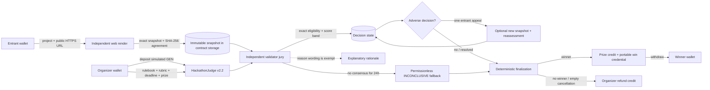

# Hackathon Judge protocol architecture

Hackathon Judge is a GenLayer-native adjudication and prize protocol for public hackathons. Organizers commit a plain-English rulebook and rubric on-chain. Entrants submit public evidence. Validators independently capture the same evidence and later agree on the small set of subjective decision fields that can move the prize.

## System boundary



The frontend owns wallet connection, forms, pagination, transaction progress, and presentation. Public evidence hosts own project pages, repositories, demos, and documentation. The intelligent contract owns all consensus-critical state: immutable terms, evidence capture, subjective decisions, appeal rights, deterministic winner selection, prize accounting, and builder credentials.

## State flow

```text
OPEN
  |-- organizer cancel, only while empty --------------------> CANCELLED + prize credit refunded
  |-- entrant submit ----------------------------------------> validator-agreed immutable snapshot
  `-- deadline passes ---------------------------------------> READY_FOR_JUDGING
                                                               |
                 permissionless evaluate_submission() --------+
                         |-- ELIGIBLE ------------------------> JUDGED
                         |-- clear rule violation ------------> INELIGIBLE
                         `-- material evidence missing -------> INCONCLUSIVE

INELIGIBLE / INCONCLUSIVE
  |-- entrant files one appeal during window ----------------> APPEAL_PENDING
  |       `-- optional different URL captured immutably
  `-- permissionless resolve_appeal() -----------------------> JUDGED / INELIGIBLE / INCONCLUSIVE

SUBMITTED / APPEAL_PENDING
  `-- unresolved for 24 hours
        `-- permissionless expire_unresolved_submission() ---> INCONCLUSIVE

all submissions evaluated and appeal rights cleared
  `-- finalize_hackathon()
        |-- highest eligible score reaches threshold --------> FINALIZED + prize credit + credential
        `-- no qualifying score ------------------------------> NO_WINNER + organizer refund credit
```

Ties use the earliest submission index. No AI call is made during winner selection or payout accounting.

## Two separate consensus operations

Evidence capture and judging deliberately do not happen in one nondeterministic operation.

1. `submit_project()` calls `gl.nondet.web.render()` inside a custom `gl.vm.run_nondet_unsafe()`. Leader and validator each normalize the render, hash it, and require exact equality of both snapshot text and digest. The contract also recomputes the leader snapshot hash before accepting the result. The agreed text and digest are stored.
2. `evaluate_submission()` judges only that saved snapshot. Validators independently parse their LLM output and compare normalized decision fields.

This prevents a mutable page from changing between submission and judging. An appeal may add a different public URL, but that page is captured into a second immutable snapshot before it can affect the reassessment.

## Equivalence principle

The protocol compares fields according to their settlement impact:

| Output | Equivalence rule | Why |
|---|---|---|
| `eligibility` | Exact | Controls whether a project can win |
| `score_band` | Exact, one of `0,20,40,60,80,100` | Controls ranking |
| `confidence_bucket` | Difference no greater than 20 | Avoids false disagreement over calibration |
| `reason` | Not compared | Natural-language explanations will not match byte-for-byte |

Low-confidence decisions become `INCONCLUSIVE`; all non-eligible decisions receive score zero. Comparing the rationale itself would make honest validators disagree constantly without improving settlement safety.

## Prize accounting

The contract uses withdrawable app credit:

- `deposit()` records simulated StudioNet GEN as credit owned by the sender.
- `create_hackathon()` debits the selected prize from organizer credit.
- `finalize_hackathon()` credits the winner, or credits the organizer when no project qualifies.
- `cancel_hackathon()` credits the organizer only when the event is still empty.
- `withdraw_credit()` performs the external transfer after zeroing credit, following checks-effects-interactions.

No deployer or administrator can select a winner, rewrite terms, or seize credit.

## Why this is not a Solidity protocol

Solidity can enforce deadlines, balances, uniqueness, and deterministic ranking. It cannot fetch an arbitrary public project page and interpret prose such as “newly built,” “materially complete,” “original,” or “best use of the technology.” Encoding every future rubric as branches would either centralize judgment in an oracle or reduce the protocol to organizer voting.

GenLayer makes the irreducibly subjective step part of validator execution. The contract narrows that subjectivity into coarse, consensus-safe fields, then returns to deterministic code for appeals, ranking, credentials, refunds, and settlement.

## Bounded release limits

- Maximum eight submissions per hackathon and 25 items per page.
- One submission per wallet and evidence URL per hackathon.
- One entrant appeal; no organizer veto and no recursive appeal chain.
- A fixed 24-hour permissionless timeout converts an unresolved initial judgment or appeal to `INCONCLUSIVE` so liveness does not depend on eventual model consensus.
- Public HTTPS text evidence only. Authentication walls, video-only proof, unstable rendering, and very large pages are unsupported.
- Snapshot text is capped at 20,000 characters; rationale is capped at 400 characters.
- Score bands trade precision for reliable validator agreement.
- StudioNet GEN is simulated test currency and has no monetary value.
- Portable credentials are address-based records, not transferable identity attestations.

## Verified StudioNet release

- Contract: `0x788432Aa8D55c81c3bd2ef0FbB29A4Bc7E6e4cC6`
- Version: `2.2.0`
- Deployment transaction: `0x4b963396d91fa9088c77c4d15fcf02197c7d397a636ff4875c0c7ad6fd1a9926`
- Source SHA-256: `5b27de829d137bdf1b89c0bb02d2742431cdc7833fb0c5b63b4285f6304a14d8`

Release checks:

```powershell
genvm-lint check contracts\hackathon_judge.py --json
pytest tests\direct\test_hackathon_judge.py -v
gltest tests\integration\test_hackathon_judge_studionet.py -v -s --network studionet
python scripts\deploy_hackathon_judge.py
```
